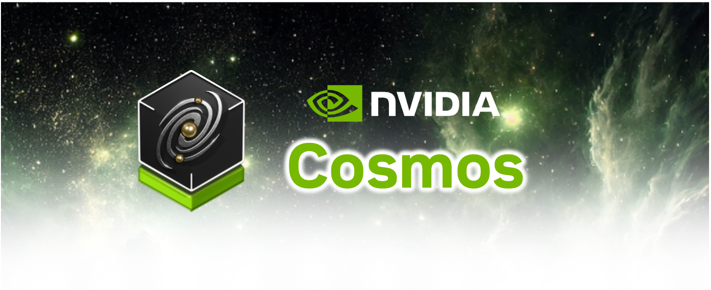

    

| Cosmos World Foundation Model Family||||
| ----------------- | ----------------- | ----------------- | ----------------- |
| [Cosmos-Predict1](https://github.com/nvidia-cosmos/cosmos-predict1) | [Code](https://github.com/nvidia-cosmos/cosmos-predict1) | [Models](https://huggingface.co/collections/nvidia/cosmos-predict1-67c9d1b97678dbf7669c89a7) | [Paper](https://arxiv.org/abs/2501.03575) |
| [Cosmos-Transfer1](https://github.com/nvidia-cosmos/cosmos-transfer1) | [Code](https://github.com/nvidia-cosmos/cosmos-transfer1) | [Models](https://huggingface.co/collections/nvidia/cosmos-transfer1-67c9d328196453be6e568d3e) | [Paper](https://arxiv.org/abs/2503.14492) |
| [Cosmos-Reason1](https://github.com/nvidia-cosmos/cosmos-reason1) | Coming soon  | Coming soon | [Paper](https://arxiv.org/abs/2503.15558) |
| | | |

[NVIDIA Cosmos](https://www.nvidia.com/cosmos/) is a developer-first world foundation model platform designed to help Physical AI developers build their Physical AI systems better and faster. Cosmos contains

1. Pre-trained models (available via Hugging Face) under the [NVIDIA Open Model License](https://www.nvidia.com/en-us/agreements/enterprise-software/nvidia-open-model-license/) that allows free commercial use.
2. Pre-training, post-training, and inference code (available in native PyTorch) under the [Apache 2 License](https://www.apache.org/licenses/LICENSE-2.0).

There are three main model families in Cosmos World Foundation Model Platform.

1. [Cosmos Predict](https://github.com/nvidia-cosmos/cosmos-predict1): a collection of general-purpose world models for future state prediction.

2. [Cosmos Transfer](https://github.com/nvidia-cosmos/cosmos-transfer1): a collection of multimodal conditional world generation model for various domain transfer applications such as Sim2Real.

3. [Cosmos Reason](https://github.com/nvidia-cosmos/cosmos-reason1): a collection of Physical AI reasoning models for planning and critics.

Being a minimalist, we have these individual models in individual repositories under [nvidia-github](https://github.com/nvidia-cosmos).

| Example Model Behavior |
|--------|
| [Cosmos-Predict Text2World](https://github.com/nvidia-cosmos/cosmos-predict1) |
| <video width="1080" controls> <source src="https://raw.githubusercontent.com/NVIDIA/Cosmos/main/assets/cosmos-predict1/predict1_text2world.mp4" type="video/mp4"> Your browser does not support the video tag.</video>|
| [Cosmos-Predict Video2World](https://github.com/nvidia-cosmos/cosmos-predict1) |
| <video width="1080" controls> <source src="https://raw.githubusercontent.com/NVIDIA/Cosmos/main/assets/cosmos-predict1/predict1_video2world.mp4" type="video/mp4"> Your browser does not support the video tag. </video> |
| [Cosmos-Transfer LiDAR + HDMap Conditional Inputs -> World](https://github.com/nvidia-cosmos/cosmos-transfer1) |
| <video width="1080" controls> <source src="https://raw.githubusercontent.com/NVIDIA/Cosmos/main/assets/cosmos-transfer1/transfer1_lidarhdmap.mp4" type="video/mp4"> Your browser does not support the video tag. </video> |
| [Cosmos-Transfer Multimodal Conditional Inputs -> World](https://github.com/nvidia-cosmos/cosmos-transfer1) |
| <video width="1080" controls> <source src="https://raw.githubusercontent.com/NVIDIA/Cosmos/main/assets/cosmos-transfer1/transfer1_lidarhdmap.mp4" type="video/mp4"> Your browser does not support the video tag. </video> |
| [Cosmos-Reason Physical AI Planning](https://github.com/nvidia-cosmos/cosmos-transfer1) |
| <video width="1080" controls> <source src="https://raw.githubusercontent.com/NVIDIA/Cosmos/main/assets/cosmos-transfer1/transfer1_multimodal.mp4" type="video/mp4"> Your browser does not support the video tag. </video> |

### Cosmos Publication

<table>
  <tr>
    <th width="40%">Paper Title</th>
    <th width="30%">Summary</th>
    <th width="15%">Authors</th>
    <th width="15%">Date</th>
  </tr>
  <tr>
    <td><a href="https://arxiv.org/abs/2503.15558">Cosmos-Reason1: From Physical Common Sense To Embodied Reasoning</a></td>
    <td>Introduces a reasoning model for physical AI that combines common sense knowledge with embodied reasoning capabilities.</td>
    <td>NVIDIA</td>
    <td>2025-03-19</td>
  </tr>
  <tr>
    <td><a href="https://arxiv.org/abs/2503.14492">Cosmos-Transfer1: Conditional World Generation with Adaptive Multimodal Control</a></td>
    <td>Presents a multimodal model for conditional world generation with adaptive control mechanisms.</td>
    <td>NVIDIA</td>
    <td>2025-03-18</td>
  </tr>
  <tr>
    <td><a href="https://arxiv.org/abs/2501.03575">Cosmos World Foundation Model Platform for Physical AI</a></td>
    <td>Overview of the Cosmos platform, its architecture, and applications in physical AI systems. Introduction of Cosmos-Predict1 world models.</td>
    <td>NVIDIA</td>
    <td>2025-01-06</td>
  </tr>
</table>

### Developer
For native PyTorch developers, we provide native PyTorch training and inference scripts in [nvidia-github](https://github.com/nvidia-cosmos). For Nemo developers, please refer to [README_CES2025.md](README_CES2025.md).
